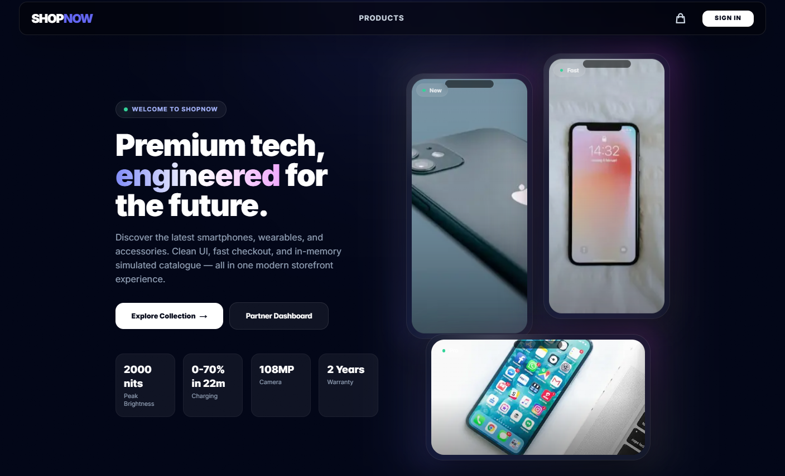
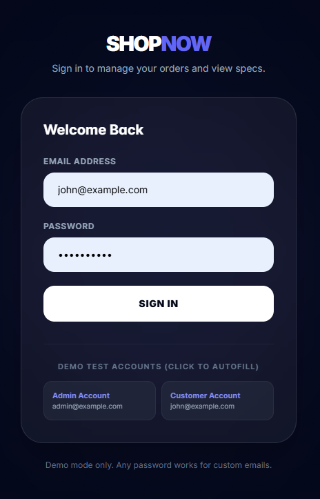
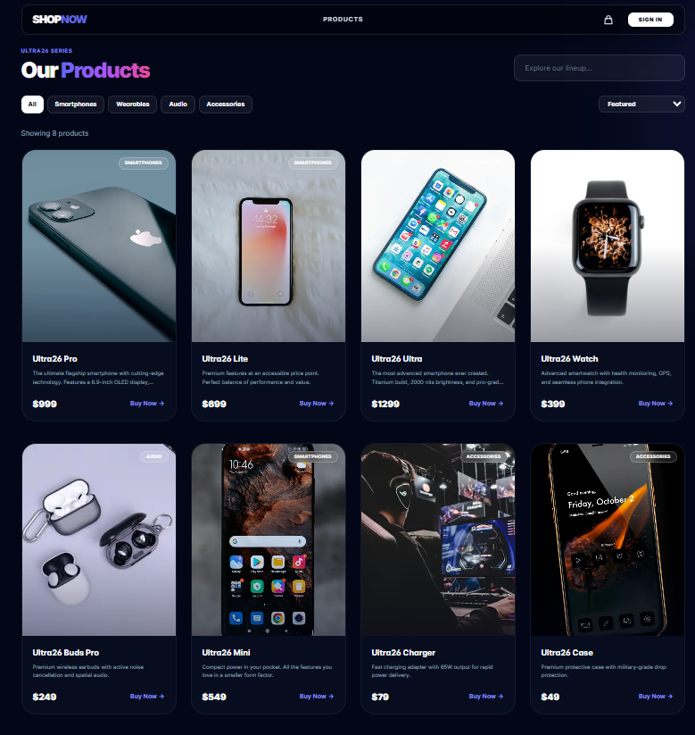

# 🛍️ ShopNow - Full Stack E-Commerce Store

A modern **full-stack e-commerce web application** built with **Next.js**, **TypeScript**, and **Tailwind CSS**, featuring a customer-facing storefront, authentication, product management APIs, and an admin dashboard for managing the store.



---

## ✨ Features

### Storefront

* Browse products with a clean and responsive UI
* Product cards and modern landing page sections
* Mobile-friendly design
* Reusable UI components like Navbar, ProductCard, and PhoneMockup

### Authentication

* User authentication system
* Secure login / signup flow
* Protected routes for authorized users

<p align="center"></p>

### Product Management

* API routes for product handling
* Create, read, update, and delete product data
* Structured backend logic for store operations



### Admin Dashboard

* Dedicated admin panel
* Manage products and store-related data
* Dashboard structure ready for future analytics/orders/users features


---

## 🛠️ Tech Stack

### Frontend

* **Next.js**
* **React**
* **TypeScript**
* **Tailwind CSS**

### Backend / API

* **Next.js API Routes**
* **Node.js**

### Other Tools

* **PostCSS**
* **ESLint**
* **Environment Variables with `.env.local`**

---

## 📁 Project Structure

```bash
├── src/
│   ├── Media/         # Static media/assets used in the app
│   ├── app/           # App Router pages, layouts, and route structure
│   ├── components/    # Reusable UI components
│   ├── lib/           # Utility functions, helpers, configs, and shared logic
│   ├── models/        # Database/models/schema definitions
│   ├── public/        # Publicly accessible static files
│   └── store/         # State management / global store logic
│
├── .env.local         # Environment variables
├── .gitignore
├── LICENSE
├── README.md
├── next-env.d.ts
├── next.config.ts
├── package.json
├── package-lock.json
├── postcss.config.mjs
├── tailwind.config.ts
└── tsconfig.json
```

---

## 🚀 Getting Started

### 1) Clone the repository

```bash
git clone https://github.com/SanaUllah04/<your-repo-name>.git
cd <your-repo-name>
```

### 2) Install dependencies

```bash
npm install
```

### 3) Add environment variables

Create a `.env.local` file in the root directory and add the required environment variables.

Example:

```env
NEXT_PUBLIC_APP_URL=http://localhost:3000
# Add your database/auth/API keys here
```

### 4) Run the development server

```bash
npm run dev
```

Now open:

```bash
http://localhost:3000
```

---

## 📌 Available Scripts

```bash
npm run dev       # Start development server
npm run build     # Build for production
npm run start     # Run production build
npm run lint      # Run linting
```

---

## 🎯 Project Goals

This project aims to provide a complete e-commerce foundation with:

* A modern shopping UI
* Scalable frontend architecture
* API-based product handling
* Authentication support
* Admin dashboard integration
* Clean and reusable component structure

---

## 🔮 Future Improvements

* Shopping cart functionality
* Checkout and payment integration
* Order management
* User profile and order history
* Product search and filtering
* Wishlist support
* Admin analytics dashboard
* Image upload for products

---

## 📄 License

This project is licensed under the terms of the **LICENSE** file included in the repository.

---

## 👨‍💻 Author

Developed by **Sana Ullah**
GitHub: [@SanaUllah04](https://github.com/SanaUllah04)
